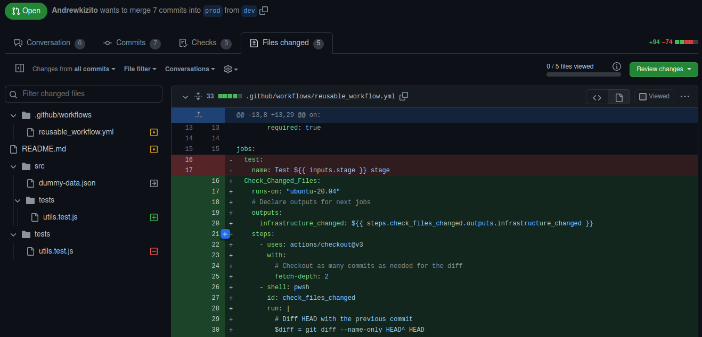
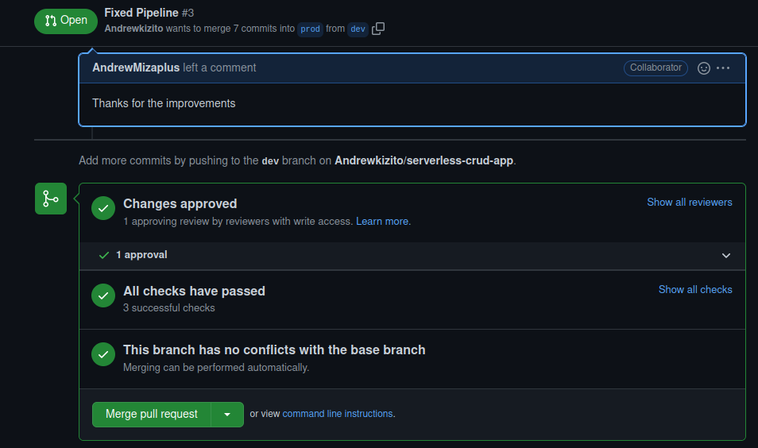
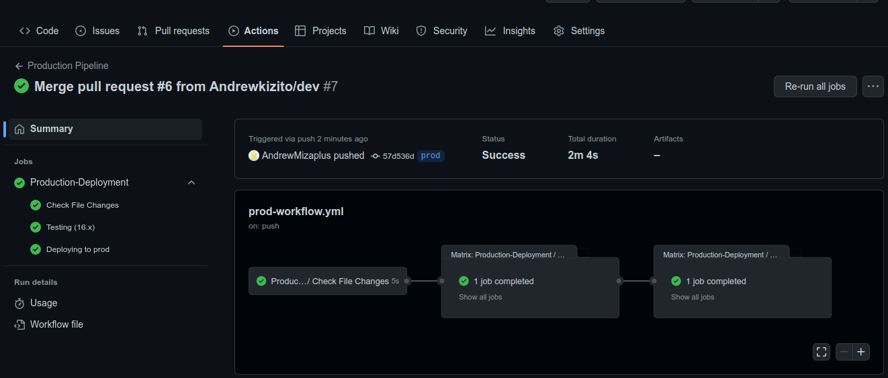

# A simple serverless crud app

This is a serverless crud application to handle management of projects.

## Available Scripts

```bash
npm run setup
```

Setup - This installs the dependencies in both the root of the application and also any other folders where external modules are utilized (lambda layers)

```bash
npm run test
```

Test - This runs all the tests that a required inorder to make sure we deploy error free code.

## Resources includes

- Rest API
- IAM Roles
- DynamoDB Table
- Lambda Functions

This application has 2 branchs; dev and prod. The prod branch is protected and you can only write to it via pull requests.

## Project structure
```bash

├── .github
│   └── workflows
│       ├── deploy-dev.yml
│       ├── deploy-prod.yml
│       ├── intergrate.yml
│       └── main-workflow.yml
├── src
│   ├── database
│   │   └── serverless.yml
│   ├── functions
│   │   ├── lambda_deleteProject.js
│   │   ├── lambda_getProjects.js
│   │   ├── layers
│   │   │   └── utils
│   │   │       └── nodejs
│   │   │           ├── package.json
│   │   │           ├── utils.js
│   │   │           └── package-lock.json
│   │   ├── models
│   │   │   ├── update.json
│   │   │   └── project.json
│   │   ├── lambda_updateProject.js
│   │   ├── lambda_addProject.js
│   │   ├── lambda_getProject.js
│   │   └── serverless.yml
│   └── roles
│       └── serverless.yml
├── tests
│   └── utils.test.js
├── serverless-compose.yml
├── package.json
├── package-lock.json
└── README.md

9 directories, 19 files
```

In the src/ folder are the different services that make up of application, which include **database**, **functions** and **roles**. On deployment, the database is created first, then the iam roles and finally the lambda functions.

**Database**: This consists of a dynamodb table that has a partition key of **PK** and sort key of **SK**. **_PK_** - is mainly used to store closely related data is the same node which improved performance and in our case the **PK** is **PROJECTS**. **_SK_** - is an id that is generated using KUIDs consisting of the curerent timestamp and this is used for sorting purposes.

**IAM Roles**: This consists of a read-role that allows reads on dynamodb (getItem and query), a write-role that allows for writes on dynamodb (putItem and updateItem) abd finally a delete-role for deletes

**Functions**: Holds all the functions with their repective API-endpoints hence deploying a Rest API in the process, code used to deploy lambda layers and finally models which validate requests as they pass through API Gateway.

**Project Model**: this defines the structure of the request to the /projects - POST. It defines all the required fields and if the request doesn't fit the schema, then it will be rejected.

```json
{
  "$schema": "http://json-schema.org/draft-04/schema#",
  "title": "Project Schema",
  "type": "object",
  "required": ["title", "description", "progress", "project_owner"],
  "properties": {
    "title": { "type": "string" },
    "description": { "type": "string" },
    "progress": { "type": "string", "pattern": "[0-9]%|[0-9][0-9]%|100%" },
    "project_owner": { "type": "string" }
  }
}
```

**Update Model**: this defines the structure of the request to /projects - PATCH.

```json
{
  "$schema": "http://json-schema.org/draft-04/schema#",
  "title": "Project Schema",
  "type": "object",
  "required": ["id"],
  "properties": {
    "id": { "type": "string" },
    "title": { "type": "string" },
    "description": { "type": "string" },
    "progress": {
      "type": "string",
      "pattern": "[0-9]%|[0-9][0-9]%|100%"
    },
    "project_owner": { "type": "string" }
  }
}
```

**.github**: This is where all the workflows associated with the deployment pipeline are stored.

**Tests**: This just contains a few tests to test files in the application

## API Endpoints

There are 5 available endpoints on the API.

- GET /projects - Returns all the projects in the database
- POST /projects - Creates a new projects, **title, description, projects_owner, and progress**(eg. 90%)
- PATCH - /projects - Updates an existing project, **id(SK)** must be included in your request body.
- GET - /projects/{id} - Gets the full details of a project, **id(SK)** must be included.
- Delete - /projects/{id} - Deletes a project from the database, **id(SK)** must be included.

## Deployment Workflow
All files related to deployment are found in the .github/ path.
We have two stages in this application i.e **dev** and **prod**, each stage is configured to utilize a separate account as best practice and this has been achieved by making use of secrets stored securely in the repository secrets section to avoid credential leakage into the public.

#### Secrets Include
Prod credentials
- PROD_ACCESS_KEY_ID
- PROD_SECRET_ACCESS_KEY

Dev credentials
- DEV_ACCESS_KEY_ID
- DEV_SECRET_ACCESS_KEY


We have two branches; **dev** and **prod**. These also represent the development stages that we have in our application repectively(dev and prod). 

## Working with dev stage
When code is commited to dev, it triggers a workflow which tests our code before deploying it to the dev account utilizing the credentials in the secrets. 


## Working with prod stage
Inorder to deploy resources to the prod stage(which is in a different account), you need to first open a pull request inorder to merge changes from the dev branch since we have branch protection rules which restrict us from directly commiting to the branch. 

After opening a pull-request, we have a workflow in place which tests the code before attempting to deploy it.


If this test passes, then another collaborator is required to approve the changes before merging the changes. 
 

After the review is complete then we can go ahead and merge the changes.
 

Then this will kickstart the deployment pipeline that pushes everything to the production account.
 


